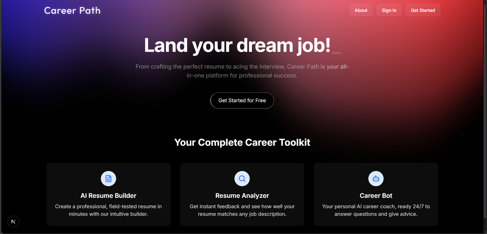

# Career Path

**Your all-in-one AI-powered career development platform.**

This is a full-stack web application built with Next.js, TypeScript, and a modern serverless stack. It unifies every stage of the job-hunting process—from building a resume to finding jobs and getting AI-powered feedback—into one seamless, modern platform.

## Live Demo

**[Click here to see the live deployment on Vercel!](https://career-path-mk.vercel.app/)**



## Core Features

This platform is built as a complete, end-to-end solution for job seekers.

### 1. AI-Powered Resume Builder

- **7-Section Form:** A comprehensive builder for Personal Info, Summary, Skills, Work Experience, Projects, Education, and Certifications.
- **Real-Time Live Preview:** A "sticky" A4-sized preview that updates instantly as you type.
- **Balanced Two-Column Layout:** A modern, professional resume layout that intelligently balances content.
- **Persistent Storage:** All resume data is automatically saved to your Neon (Postgres) database.

### 2. JD-to-Resume Analyzer

- **Paste Any Job Description:** A dedicated page to analyze your saved resume against any job description from any source.
- **Powered by Groq & Llama 3:** Uses the Groq API for high-speed analysis, structured as a JSON response.
- **Actionable Feedback:** Returns a detailed report including a **Match Score (%)**, **Overall Fit Summary**, **Key Strengths**, **Areas for Improvement**, and **Missing Keywords**.

### 3. Smart Job Portal

- **Real-World Job Data:** Fetches live job postings from the JSearch API.
- **Advanced Filtering:** Includes filters for query, location, date posted, remote work, and employment type (Full-time, Intern, etc.).
- **"Match My Resume" Button:** The app's "killer feature." With one click, you can run your saved resume against any job in the search results, instantly showing you a full analysis in a modal.

### 4. AI Career Bot

- **Conversational AI:** A beautiful, ChatGPT-style chat interface (built with Aceternity UI) for career advice.
- **Custom Persona:** Uses a Groq API-call with a custom "system prompt" to act as a professional career coach.
- **Persistent Chat History:** All conversations are saved to and retrieved from the Neon database.

### 5. Dynamic User Dashboard

- **Modern "Bento Box" Layout:** A clean, engaging dashboard that serves as the app's command center.
- **Real, Personalized Data:** The dashboard is a Server Component that fetches:
  - Your **AI Resume Tip of the Day** (generated by Groq).
  - Your **Recent Chat History**.
  - A **Cached Job Feed** of recommended jobs (this smart caching saves API calls).

### 6. Full-Stack Authentication

- **Clerk Auth:** Secure authentication with dedicated, custom-styled `/sign-in` and `/sign-up` pages.
- **Protected Routes:** A custom `middleware.ts` file protects all app routes and correctly handles redirects for logged-in and logged-out users.
- **Automatic User Sync:** Automatically syncs new Clerk users into the Neon `User` database table.

---

## Tech Stack

This project uses a modern, server-centric, and type-safe stack.

- **Framework:** [Next.js](https://nextjs.org/) (App Router)
- **Language:** [TypeScript](https://www.typescriptlang.org/)
- **Authentication:** [Clerk](https://clerk.com/)
- **Database:** [Neon](https://neon.tech/) (Serverless Postgres)
- **ORM:** [Prisma](https://www.prisma.io/)
- **AI / LLM:** [Groq API](https://groq.com/) (running Llama 3)
- **External APIs:** [JSearch](https://www.google.com/search?q=https://rapidapi.com/jsearch/api/jsearch) (via RapidAPI)
- **UI Components:** [Shadcn/ui](https://ui.shadcn.com/), [Aceternity UI](https://ui.aceternity.com/), & [Magic UI](https://magicui.design/)
- **Styling:** [Tailwind CSS (v4)](https://tailwindcss.com/)
- **Animation:** [Motion](https://www.motion.dev/)
- **Deployment:** [Vercel](https://vercel.com/)

---

## ⚙️ Getting Started

### 1. Set Up Your Environment

You will need to create a `.env` file in the root of the project and add the following environment variables.

```
# 1. Clerk (get from clerk.com)
NEXT_PUBLIC_CLERK_PUBLISHABLE_KEY=
CLERK_SECRET_KEY=
NEXT_PUBLIC_CLERK_SIGN_IN_URL=/sign-in
NEXT_PUBLIC_CLERK_SIGN_UP_URL=/sign-up
NEXT_PUBLIC_CLERK_AFTER_SIGN_IN_URL=/dashboard
NEXT_PUBLIC_CLERK_AFTER_SIGN_UP_URL=/dashboard

# 2. Neon Database (get from neon.tech)
DATABASE_URL="postgres://..."

# 3. Groq API (get from groq.com)
GROQ_API_KEY=

# 4. RapidAPI (get from rapidapi.com, for JSearch)
RAPIDAPI_KEY=
```

### 2. Install Dependencies & Run

```bash
# Install all packages
npm install

# Push the database schema to Neon
npx prisma migrate dev --name init

# Run the development server
npm run dev
```

Open [http://localhost:3000](https://www.google.com/search?q=http://localhost:3000) with your browser to see the result.

---
